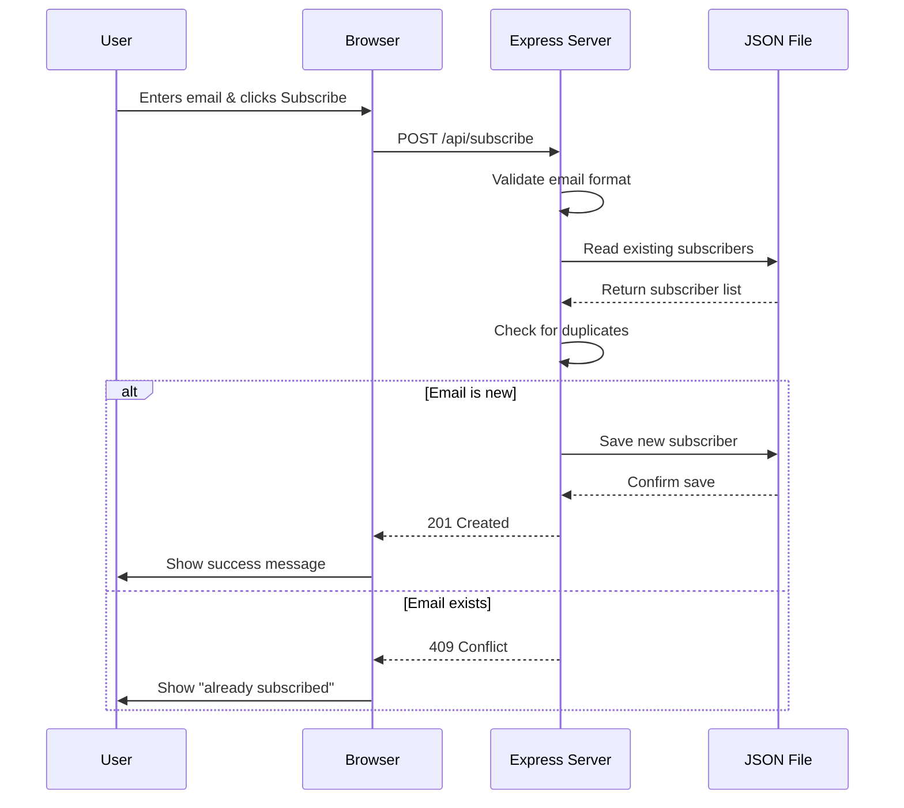

# Development Server Setup - Walkthrough

## Overview

Successfully transformed the Youthness website from a static file-based application to a proper development environment with a Node.js/Express backend server and REST API for newsletter subscriptions.

## What Was Changed

### Backend Infrastructure

#### 1. Express Server ([server.js](file:///home/djgarcia/Code/lanparty/taller_antigravity/free-web/server.js))
Created a complete Express.js backend server with:
- **Static file serving**: Serves all HTML, CSS, JS, and image files
- **REST API endpoints**: `/api/subscribe` (POST) and `/api/subscribers/count` (GET)
- **JSON file storage**: Persists subscriber data in `subscribers.json`
- **Validation**: Email format validation and duplicate detection
- **Error handling**: Proper HTTP status codes (201, 409, 400, 500)

#### 2. Package Configuration ([package.json](file:///home/djgarcia/Code/lanparty/taller_antigravity/free-web/package.json))
- Added Express, CORS, and body-parser dependencies
- Created npm scripts for easy server startup
- Configured project metadata

#### 3. Data Storage ([subscribers.json](file:///home/djgarcia/Code/lanparty/taller_antigravity/free-web/subscribers.json))
- Server-side JSON file for storing newsletter subscriptions
- Each entry includes email and subscription timestamp
- Persists across server restarts

### Frontend Updates

#### Updated JavaScript ([script.js](file:///home/djgarcia/Code/lanparty/taller_antigravity/free-web/script.js))
Completely rewrote newsletter functionality:
- **Removed**: All `localStorage` references
- **Added**: `fetch()` API calls to backend
- **Enhanced**: Error handling for network failures
- **Improved**: User feedback with loading states ("Subscribing...")

**Key Changes:**
```javascript
// Old: localStorage-based
localStorage.setItem('newsletterSubscribers', JSON.stringify(subscribers));

// New: API-based
const response = await fetch('/api/subscribe', {
    method: 'POST',
    headers: { 'Content-Type': 'application/json' },
    body: JSON.stringify({ email })
});
```

### Documentation

#### README.md
Created comprehensive documentation covering:
- Installation and setup instructions
- API endpoint specifications
- Development workflow
- Production deployment guidance

#### .gitignore
Added proper exclusions for:
- `node_modules/`
- `subscribers.json` (contains user data)
- IDE and OS files

## Testing Results

### Server Startup

The server successfully started on port 3001:

```
╔════════════════════════════════════════════════════════╗
║   🎉 Youthness Development Server Running!            ║
║   📍 Local:   http://localhost:3001                    ║
║   📡 API Endpoints:                                    ║
║      POST /api/subscribe                               ║
║      GET  /api/subscribers/count                       ║
╚════════════════════════════════════════════════════════╝
```

### Newsletter Functionality Testing

Comprehensive browser testing confirmed all features work correctly:

#### ✅ Test 1: New Subscription
- **Email**: `test@devserver.com`
- **Result**: Success message displayed
- **Server Log**: `✅ New subscriber: test@devserver.com`
- **Visual**: Success popup with "Welcome to the Squad!" message


#### ✅ Test 2: Duplicate Detection
- **Email**: `test@devserver.com` (same as above)
- **Result**: "You're Already Subscribed!" message
- **Server Response**: HTTP 409 Conflict
- **Visual**: Purple heart message confirming duplicate


#### ✅ Test 3: Multiple Subscribers
- **Email**: `another@devserver.com`
- **Result**: Success message displayed
- **Server Log**: `✅ New subscriber: another@devserver.com`
- **Verification**: Both emails stored in `subscribers.json`

### Server-Side Data Verification

The `subscribers.json` file correctly stores all subscriptions:

```json
{
  "subscribers": [
    {
      "email": "test@devserver.com",
      "subscribedAt": "2026-02-12T19:34:45.855Z"
    },
    {
      "email": "another@devserver.com",
      "subscribedAt": "2026-02-12T19:35:10.857Z"
    }
  ]
}
```

## Technical Implementation

### API Flow



### Key Features

**Server-Side Storage**
- ✅ Data persists across browser sessions
- ✅ Data persists across server restarts
- ✅ Shared across all users/devices
- ✅ Ready for database migration

**API Integration**
- ✅ RESTful design with proper HTTP methods
- ✅ JSON request/response format
- ✅ Appropriate status codes (201, 409, 400, 500)
- ✅ CORS enabled for development

**User Experience**
- ✅ Loading state during API calls
- ✅ Clear success/error messages
- ✅ Duplicate prevention
- ✅ Form validation

## Development Workflow

### Starting the Server
```bash
npm install  # First time only
npm start    # Start development server
```

### Accessing the Application
Open browser to: `http://localhost:3001`

### Viewing Subscribers
Check the `subscribers.json` file or use the API:
```bash
curl http://localhost:3001/api/subscribers/count
```

## Production Readiness

### Current State (Development)
- ✅ Working API endpoints
- ✅ Server-side data storage
- ✅ Proper validation
- ✅ Error handling
- ⚠️ JSON file storage (simple but not scalable)

### Next Steps for Production
1. **Database Integration**: Replace JSON file with MongoDB/PostgreSQL
2. **Email Service**: Add actual email sending (SendGrid, Mailchimp)
3. **Security**: Add rate limiting, HTTPS, input sanitization
4. **Deployment**: Deploy to Vercel, Netlify, or similar platform
5. **Monitoring**: Add logging and error tracking

## Summary

The website now operates as a proper web application with:
- **Backend**: Node.js/Express server on port 3001
- **API**: RESTful endpoints for newsletter management
- **Storage**: Server-side JSON file (easily replaceable with database)
- **Frontend**: Modern fetch() API calls instead of localStorage

This setup provides a production-like development environment and makes it easy to migrate to a full production stack when needed.

## Demo Recording


The complete browser testing session showing all functionality working correctly.
